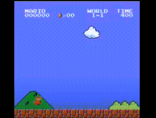

# Mario Game with RL agent

## Introduction

AI-powered implementation of Mario Game using Deep Reinforce Learning



## Environment

- python 3.7
- RTX 3090

```
pip install -r requirements.txt
```

## Training

### Deep Q-Networks
```
python mario_dqn.py
```

### Double Deep Q-Networks
```
python mario_ddqn.py
```

### Dueling Deep Q-Networks
```
python mario_dueling_dqn.py
```

### Dueling Double Deep Q-Networks
```
python mario_dueling_ddqn.py
```

## Pre-trained

- link

## Checkpoint

- stored in `./checkpoints`

## Visualization

- stored in `./vis`
